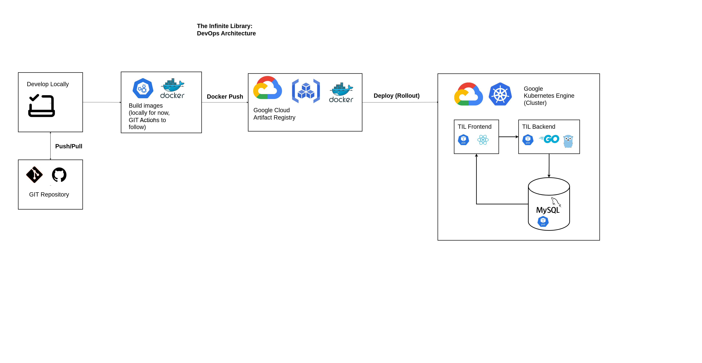

Rewriting the bookworm app in go (backend) and typescript (react) frontend. No AI assistant or copy-paste-coding allowed :)

Frontend is deployed at

http://www.theinfinitelibrary.club/ 

# Architecture

## DevOps Architecture

